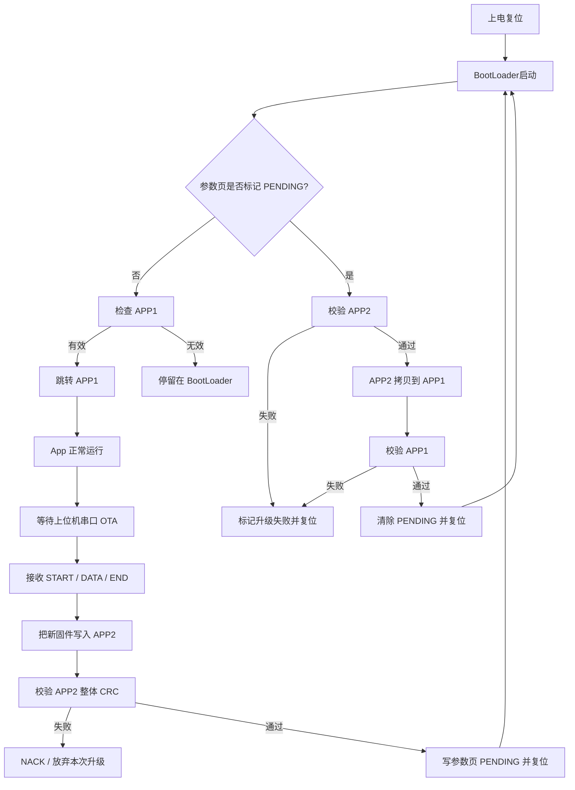
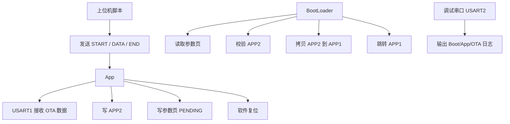

# STM32F407ZGT6 BootLoader + UART OTA

## 1. 工程说明

这是一个基于 `STM32F407ZGT6 + STM32 HAL + xmake` 的双镜像升级工程，包含两个独立固件：

- `bootloader`
- `app`

整体升级方式不是“BootLoader 直接收串口下载”，而是：

1. `App` 运行在 `APP1`
2. 上位机通过串口把新固件发给 `App`
3. `App` 把新固件写入 `APP2`
4. `App` 写参数页，设置 `BL_UPDATE_FLAG_PENDING`
5. `App` 软件复位
6. `BootLoader` 上电后检测到 `PENDING`
7. `BootLoader` 校验 `APP2`
8. `BootLoader` 将 `APP2` 拷贝到 `APP1`
9. `BootLoader` 再校验 `APP1`
10. 成功后跳转运行新的 `APP1`

这个流程的好处是：

- 下载和升级动作分离
- 升级失败不会直接破坏当前运行区
- 可以做参数页恢复、升级状态跟踪、错误记录

---

## 2. 目录结构

### 2.1 顶层目录

- `BootLoader/`
  BootLoader 逻辑文件
- `App/`
  App 侧任务、UART DMA 轮询、调试串口等
- `Common/`
  BootLoader / App 共用分区、参数页、Flash 接口
- `Component/ota/`
  OTA 协议、CRC、环形缓冲、OTA 状态机
- `bsp/HAL_boot/`
  BootLoader 专用 CubeMX/HAL 工程
- `bsp/HAL_app/`
  App 专用 CubeMX/HAL 工程
- `script/`
  构建辅助脚本和 OTA 发送脚本

### 2.2 关键文件

- `BootLoader/Src/bl_core.c`
  BootLoader 主流程：参数页检查、APP2 校验、APP2 -> APP1 拷贝、跳转
- `Common/bl_flash_if.c`
  STM32F407 Flash 擦写、参数页写入、App 跳转
- `Common/bl_partition.h`
  Flash 分区定义
- `Common/bl_param.h`
  参数页结构、升级标志、日志结构
- `Component/ota/ota_protocol.h`
  串口 OTA 协议定义
- `Component/ota/ota_uart.c`
  App 侧 OTA 接收状态机
- `App/Src/app_uart_dma.c`
  OTA 串口 DMA 接收轮询
- `App/Src/debug_uart.c`
  调试串口 `USART2` 输出
- `script/ota_uart_sender.py`
  上位机串口发送脚本

---

## 3. Flash 分区

分区定义见：

- [Common/bl_partition.h](Common/bl_partition.h)

当前分区如下：

| 区域 | 起始地址 | 大小 | 说明 |
| --- | --- | --- | --- |
| `BOOT` | `0x08000000` | `64KB` | BootLoader 固件 |
| `PARAM` | `0x08010000` | `64KB` | 参数页，包含主副本和日志区 |
| `APP1` | `0x08020000` | `384KB` | 当前运行的应用固件 |
| `APP2` | `0x08080000` | `512KB` | OTA 下载暂存区 |

### 3.1 为什么这样划分

`STM32F407` 采用 sector 擦除，不能按 GD32 那种固定小 page 模型直接搬。  
当前分区是按 F407 的 Flash sector 边界做的适配，方便：

- `BOOT` 独立烧录
- 参数页单独占区
- `APP1` 和 `APP2` 分离
- OTA 时只写 `APP2`

---

## 4. 参数页设计

参数页结构定义见：

- [Common/bl_param.h](Common/bl_param.h)

关键点：

- 主参数副本地址：`BL_PARAM_MAIN_ADDR`
- 备份参数副本地址：`BL_PARAM_BACKUP_ADDR`
- 日志区地址：`BL_LOG_ADDR`
- 通过 `magic + version + tail_magic + param_crc32` 判断是否有效

### 4.1 关键标志

- `BL_UPDATE_FLAG_IDLE`
  无待升级任务
- `BL_UPDATE_FLAG_PENDING`
  已下载完成，等待 BootLoader 升级
- `BL_UPDATE_FLAG_FAILED`
  升级失败

### 4.2 参数页在流程中的作用

App 下载完固件后不会直接覆盖 `APP1`，而是：

1. 把镜像写进 `APP2`
2. 写参数页
3. 设置：
   - `app_size`
   - `app_crc32`
   - `app1_addr`
   - `app2_addr`
   - `update_flag = BL_UPDATE_FLAG_PENDING`
4. 复位

BootLoader 下次启动时读取参数页，判断是否需要升级。

---

## 5. BootLoader 具体实现

BootLoader 主流程见：

- [BootLoader/Src/bl_core.c](BootLoader/Src/bl_core.c)

### 5.1 启动流程

BootLoader 上电后做这些事：

1. 读取主参数副本和备份副本
2. 分别校验参数页
3. 选出有效参数
4. 如果参数损坏，则恢复默认参数并重写参数页
5. 如果 `update_flag == BL_UPDATE_FLAG_PENDING`，进入升级流程
6. 如果没有待升级任务，则尝试跳转 `APP1`

### 5.2 升级流程

BootLoader 升级过程如下：

1. 检查 `APP2` 向量表是否合法
2. 计算 `APP2` 的 CRC32
3. 与参数页中的 `app_crc32` 比较
4. 校验通过后擦除 `APP1`
5. 以 `BL_COPY_CHUNK_SIZE` 为单位将 `APP2` 拷贝到 `APP1`
6. 拷贝完成后再次计算 `APP1` 的 CRC32
7. 如果一致：
   - 清除 `PENDING`
   - `update_counter++`
   - 记录成功日志
   - 复位
8. 如果失败：
   - 置 `BL_UPDATE_FLAG_FAILED`
   - `fail_counter++`
   - 记录失败日志
   - 复位

### 5.3 App 跳转

跳转逻辑在：

- [Common/bl_flash_if.c](Common/bl_flash_if.c)

跳转前会做：

1. 校验 MSP 是否落在 SRAM 范围
2. 校验 ResetHandler 是否落在 Flash 范围
3. 关闭 SysTick
4. 清空 NVIC
5. 重定位 `VTOR`
6. 切换 MSP
7. 打开中断
8. 跳转到 App ResetHandler

---

## 6. App 具体实现

App 主入口位于：

- [bsp/HAL_app/Core/Src/main.c](bsp/HAL_app/Core/Src/main.c)

### 6.1 App 启动流程

App 启动后：

1. `HAL_Init()`
2. `SystemClock_Config()`
3. `SCB->VTOR = BL_APP1_START_ADDR`
4. 初始化 GPIO / DMA / USART1 / USART2
5. 初始化 OTA UART DMA
6. 初始化 OTA 状态机
7. 初始化调度器
8. 在主循环中运行 `scheduler_run()`

### 6.2 App 侧任务

调度器见：

- [App/Src/scheduler.c](App/Src/scheduler.c)

当前任务包括：

- `app_uart_dma_poll`
  轮询 OTA 串口 DMA 新数据
- `ota_uart_task`
  解析 OTA 帧协议
- `uart_task`
  调试串口任务
- `led_task`
  LED 翻转任务

---

## 7. OTA 协议实现

协议定义见：

- [Component/ota/ota_protocol.h](Component/ota/ota_protocol.h)

### 7.1 帧类型

- `START`
  发送镜像头信息
- `DATA`
  发送固件分片
- `END`
  结束传输并提交
- `ACK`
  设备确认接收成功
- `NACK`
  设备确认接收失败

### 7.2 V2 Header 内容

当前推荐使用 `v2` 头，包含：

- `magic`
- `header_version`
- `header_size`
- `app_version`
- `app_size`
- `app_crc32`
- `target_addr`
- `image_type`
- `hw_id`
- `header_crc32`

### 7.3 App 侧 OTA 状态机

实现位于：

- [Component/ota/ota_uart.c](Component/ota/ota_uart.c)

处理过程：

1. 收到 `START`
   - 解析 header
   - 校验大小、目标地址、镜像类型、header CRC
   - 擦除 `APP2`
2. 收到 `DATA`
   - 检查 `seq`
   - 检查 `offset`
   - 检查 payload CRC
   - 写入 `APP2`
   - 更新整体 CRC
3. 收到 `END`
   - 检查总长度
   - 检查整体 CRC
   - 写参数页
   - 软件复位

### 7.4 Flow Control

为了防止接收太快导致 OTA 软件缓冲溢出，App 侧支持：

- `PAUSE`
- `RESUME`

当环形缓冲区快满时，发送 `PAUSE`；  
缓冲区回落后，再发送 `RESUME`。

---

## 8. 串口分工

### 8.1 OTA 串口

- `USART1`
- 用途：接收上位机 OTA 数据
- 当前配置：DMA RX + 轮询 DMA 写指针

实现文件：

- [App/Src/app_uart_dma.c](App/Src/app_uart_dma.c)

### 8.2 调试串口

- `USART2`
- 用途：输出 BootLoader / App / OTA 日志
- 当前配置：普通阻塞发送

实现文件：

- [App/Src/debug_uart.c](App/Src/debug_uart.c)

---

## 9. 构建方式

构建配置见：

- [xmake.lua](xmake.lua)

### 9.1 目标

- `bootloader`
- `app`

### 9.2 HAL 目录

- `bootloader` 使用 `bsp/HAL_boot`
- `app` 使用 `bsp/HAL_app`

### 9.3 编译命令

编译 BootLoader：

```powershell
xmake -r bootloader
```

编译 App：

```powershell
xmake -r app
```

编译完成后会自动生成：

- `bootloader.bin`
- `app.bin`

默认输出目录：

- `build/cross/arm/release/`

---

## 10. 烧录方式

### 10.1 首次烧录

首次必须手工烧录两份固件：

1. `bootloader.bin` 烧到 `0x08000000`
2. `app.bin` 烧到 `0x08020000`

### 10.2 首次烧录成功的现象

`USART2` 调试串口应看到：

```text
BOOT: stm32 bootloader start
BL: main_valid=1 backup_valid=1
BL: jumping to APP1 @ 0x08020000
APP: stm32 ota app start
APP: VTOR=0x08020000
```

如果还看到：

```text
BL: APP1 invalid, stay in bootloader
```

说明 `APP1` 镜像未正常烧录或链接地址不匹配。

---

## 11. OTA 脚本使用方法

上位机脚本位于：

- [script/ota_uart_sender.py](script/ota_uart_sender.py)

### 11.1 依赖安装

安装 `pyserial`：

```powershell
py -m pip install pyserial
```

### 11.2 基本命令

```powershell
py script\ota_uart_sender.py --port COM5 --bin build\cross\arm\release\app.bin
```

### 11.3 推荐命令

```powershell
py script\ota_uart_sender.py `
  --port COM5 `
  --baud 115200 `
  --bin build\cross\arm\release\app.bin `
  --header-version v2 `
  --target-addr 0x08020000 `
  --version 0x00010001
```

### 11.4 参数说明

- `--port`
  OTA 串口号，必须连接 `USART1`
- `--baud`
  波特率，当前默认 `115200`
- `--bin`
  要发送的固件 bin 文件
- `--header-version`
  `v1` 或 `v2`，推荐 `v2`
- `--target-addr`
  目标地址，当前应为 `0x08020000`
- `--version`
  固件版本号，支持十六进制
- `--chunk`
  每帧发送的数据长度，默认 `256`
- `--ack-timeout`
  每帧 ACK 超时时间
- `--start-timeout`
  `START` 帧超时时间
- `--retries`
  单帧失败后的重试次数

### 11.5 串口连接要求

- `USART1`：OTA 脚本使用
- `USART2`：日志串口使用

不要把脚本发到 `USART2`，否则只会超时，不会收到 `ACK`。

### 11.6 正常发送时的脚本输出

示例：

```text
port      : COM5
baud      : 115200
firmware  : build\cross\arm\release\app.bin
version   : 0x00010001
size      : 17128 bytes
crc32     : 0x16FA77E0
header    : v2
target    : 0x08020000
chunk     : 256 bytes
start ack : received
sent      : 4096/17128 (23%)
sent      : 8192/17128 (47%)
...
end ack   : received
finished
```

---

## 12. OTA 成功时的调试日志

`USART2` 调试串口上，正常 OTA 升级应大致看到：

### App 阶段

```text
APP: stm32 ota app start
APP: VTOR=0x08020000
OTA: begin ver=0x00010002 size=17128 crc=0x16FA77E0
OTA: progress 4096/17128 (23%)
OTA: progress 8192/17128 (47%)
...
OTA: pending update armed
OTA: done, reset to bootloader
```

### BootLoader 阶段

```text
BOOT: stm32 bootloader start
BL: main_valid=1 backup_valid=1
BL: pending update size=17128 crc=0x16FA77E0
BL: APP2 crc calc=0x16FA77E0 expect=0x16FA77E0
BL: APP1 crc calc=0x16FA77E0 expect=0x16FA77E0
BL: jumping to APP1 @ 0x08020000
APP: stm32 ota app start
APP: VTOR=0x08020000
```

---

## 13. 当前实现状态

当前工程已经实现：

- BootLoader / App 双固件拆分
- 双镜像升级流程
- 参数页主副本机制
- OTA 串口协议
- `APP2` 下载
- `APP2 -> APP1` 拷贝升级
- 上位机 Python 发送脚本
- `USART2` 调试日志

当前最适合作为：

- STM32F407 双分区 BootLoader + UART OTA 基础工程
- 后续扩展更多外设或业务逻辑的基础版本

---

## 14. 常见问题排查

### 14.1 上电后停在 BootLoader，日志显示 `BL: APP1 invalid, stay in bootloader`

说明 BootLoader 检查 `APP1` 向量表失败，没有成功跳转到 App。

优先检查：

1. App 是否真的烧录到了 `0x08020000`
2. `bsp/HAL_app/STM32F407XX_APP1.ld` 的 `FLASH ORIGIN` 是否为 `0x08020000`
3. App 启动时是否执行了：

```c
SCB->VTOR = BL_APP1_START_ADDR;
```

4. `bl_is_app_vector_valid()` 是否允许初始 MSP 指向 SRAM 顶部地址

正常情况下，App 的前 8 字节应满足：

- MSP 在 SRAM 范围内
- ResetHandler 在 Flash 范围内

如果 App 已正常烧录，Boot 日志应看到：

```text
BL: jumping to APP1 @ 0x08020000
APP: stm32 ota app start
```

### 14.2 脚本一直提示 `START: ACK timeout`

这通常不是脚本问题，而是 App 侧 OTA 接收链路没有真正工作。

优先检查：

1. 脚本连接的是 `USART1`，不是 `USART2`
2. `APP1` 已经正常启动
3. App 侧执行了：

```c
MX_USART1_UART_Init();
app_uart_dma_init();
ota_uart_reset_state();
```

4. 主循环或调度器中确实在运行：

```c
app_uart_dma_poll();
ota_uart_task();
```

5. `USART2` 调试串口是否已经看到：

```text
APP: stm32 ota app start
APP: VTOR=0x08020000
```

如果 App 没启动，或者脚本发到了 `USART2`，就一定收不到 `ACK`。

### 14.3 OTA 下载成功，但复位后 Boot 显示 `main_valid=0 backup_valid=0`

说明 App 已经把固件写进了 `APP2`，但参数页提交后，BootLoader 读取参数页校验失败。

典型现象：

```text
OTA: pending update armed
OTA: done, reset to bootloader
BOOT: stm32 bootloader start
BL: main_valid=0 backup_valid=0
```

优先检查：

1. App 侧 `param_commit_update()` 是否正确写入：
   - `magic`
   - `version`
   - `app_size`
   - `app_crc32`
   - `app1_addr`
   - `app2_addr`
   - `tail_magic`
   - `param_crc32`
2. BootLoader 侧 `bl_param_is_valid()` 的 CRC 计算是否正确
3. 参数页主副本偏移：
   - `BL_PARAM_MAIN_ADDR`
   - `BL_PARAM_BACKUP_ADDR`
   是否与 App / Boot 一致
4. 参数页所在扇区是否被其它代码意外擦除

当前工程已经支持在 BootLoader 中逐项打印参数校验失败原因，可以直接看：

- `magic` 是否不对
- `tail_magic` 是否不对
- `version` 是否不对
- `app1_addr/app2_addr` 是否不对
- `param_crc32` 是否不匹配

### 14.4 App 有启动日志，但 LED 不闪

如果你已经看到：

```text
APP: stm32 ota app start
```

那说明 App 主入口已经运行，不能简单判定为“程序死掉了”。

优先检查：

1. `led_task()` 是否已经加入调度器
2. `scheduler_init()` 是否执行
3. `scheduler_run()` 是否在主循环里持续运行
4. LED 引脚是否和硬件一致
5. BootLoader 跳转到 App 前是否重新打开了全局中断

如果 BootLoader 跳转时执行了 `__disable_irq()`，但没有在跳转前重新 `__enable_irq()`，会出现：

- App 日志能打印
- 但 `SysTick` 不工作
- 调度器不走
- LED 不闪

当前工程已经在 App 跳转前恢复了中断。

### 14.5 OTA 下载到 100%，但没有真正升级到新版本

如果你看到：

```text
OTA: progress ... 100%
OTA: pending update armed
OTA: done, reset to bootloader
```

只说明：

- `APP2` 下载成功

还不能说明：

- `APP2 -> APP1` 升级已经成功

真正升级成功还需要在 Boot 阶段看到：

```text
BL: pending update size=...
BL: APP2 crc calc=... expect=...
BL: APP1 crc calc=... expect=...
BL: jumping to APP1 @ 0x08020000
```

如果没有这些日志，说明升级只完成了“下载”，没有完成“提交和搬运”。

### 14.6 如何区分调试串口和 OTA 串口

当前工程默认分工：

- `USART1`：OTA 数据口
- `USART2`：调试日志口

判断方法：

1. 如果某个串口上能看到：

```text
BOOT: ...
APP: ...
OTA: ...
```

那它就是 `USART2`

2. `ota_uart_sender.py` 应该连接 `USART1`

3. 不要把 OTA 脚本发到调试口，否则只会超时

### 14.7 首次联调建议顺序

建议按下面顺序排查：

1. 先手工烧录 `bootloader.bin`
2. 再手工烧录 `app.bin` 到 `APP1`
3. 上电确认 Boot 能跳转 App
4. 看 `USART2` 是否有启动日志
5. 再运行 `ota_uart_sender.py`
6. 观察 `USART2` 上的 OTA 日志
7. 最后确认 Boot 阶段是否真的执行了 `APP2 -> APP1`

---

## 15. 流程图

### 15.1 总流程图



### 15.2 职责分工图



### 15.3 记忆要点

- `App 管下载，BootLoader 管搬运`
- `新固件先写 APP2，不直接覆盖 APP1`
- `参数页只负责告诉 BootLoader：下次上电需要升级`
- `脚本发 START / DATA / END，设备回 ACK / NACK`
- `真正把 APP2 变成 APP1 的动作只发生在 BootLoader 启动阶段`
